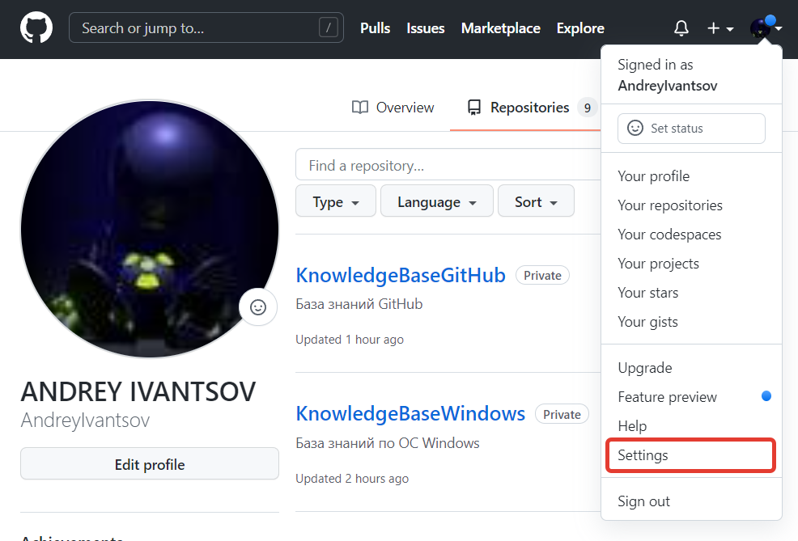
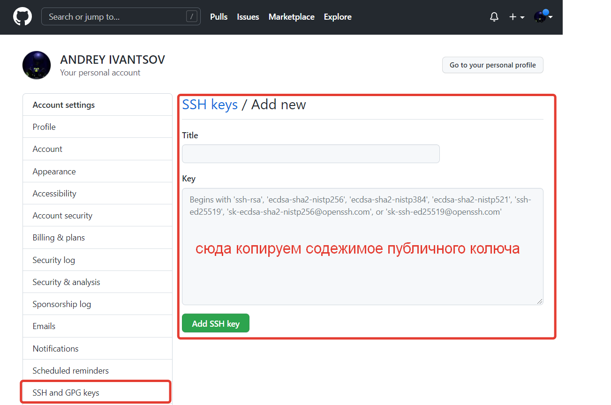
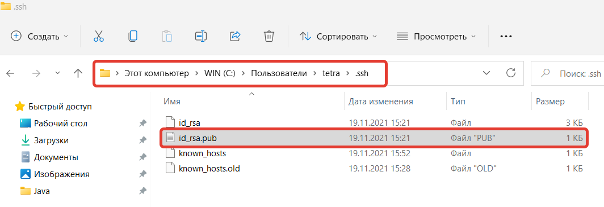
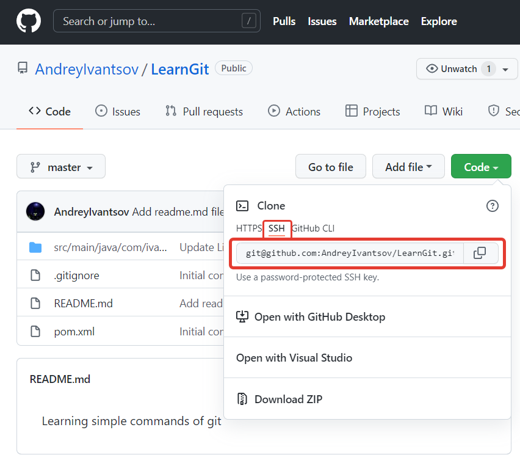
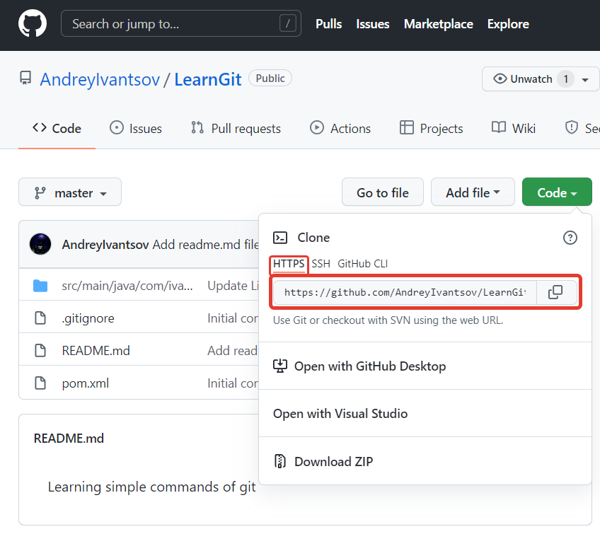

# Аутентификация

### Настройка SSH-Key (Linux)

Необходимо сгенерировать _**ssh**_ ключи: _**private**_ и _**pubic**_.

Ключи будут размещены в домашней папке `~/.ssh`.

Выполним команду (на все запросы нажимаем Enter):

`$ ssh-keygen`

Проверим, что ключи созданы

`$ ll ~/.ssh/`

Выведем в консоль содержимое публичного ключа

`$ cat ~/.ssh/id_rsa.pub`

Скопируем все содержимое файла из консоли в буфер обмена и перейдем на сайт _**github.com**_ в раздел настроек.

Создадим новый _**ssh-key**_ скопировав в него содержимое публичного ключа из буфера обмена.

### Настройка SSH-Key (Windows)

Установить оболочку [Git Bash](https://gitforwindows.org).

Выполнить действия аналогичные при настройке по Linux.

Место хранения ключей:

`C:\Users\<имя пользователя>\.ssh\id_rsa.pub`

### Перевод аутентификации с https на ssh-key

Посмотрим с какой ссылкой соединен наш локальный репозиторий:

`$ git remote -v`

`learngit https://github.com/AndreyIvantsov/LearnGit.git (fetch)`

`learngit https://github.com/AndreyIvantsov/LearnGit.git (push)`

Поменяем соединение на _**ssh**_

`$ git remote set-url learngit git@github.com:AndreyIvantsov/LearnGit.git`

### Проверим соединение

`$ git remote -v`

`learngit git@github.com:AndreyIvantsov/LearnGit.git (fetch)`

`learngit git@github.com:AndreyIvantsov/LearnGit.git (push)`

### Перевод аутентификации с ssh-key на https

Посмотрим с какой ссылкой соединен наш локальный репозиторий:

`$ git remote -v`

`learngit git@github.com:AndreyIvantsov/LearnGit.git (fetch)`

`learngit git@github.com:AndreyIvantsov/LearnGit.git (push)`

Поменяем соединение на _**https**_

`$ git remote set-url learngit https://github.com/AndreyIvantsov/LearnGit.git`

### Проверим соединение

`$ git remote -v`

`learngit https://github.com/AndreyIvantsov/LearnGit.git (fetch)`

`learngit https://github.com/AndreyIvantsov/LearnGit.git (push)`
