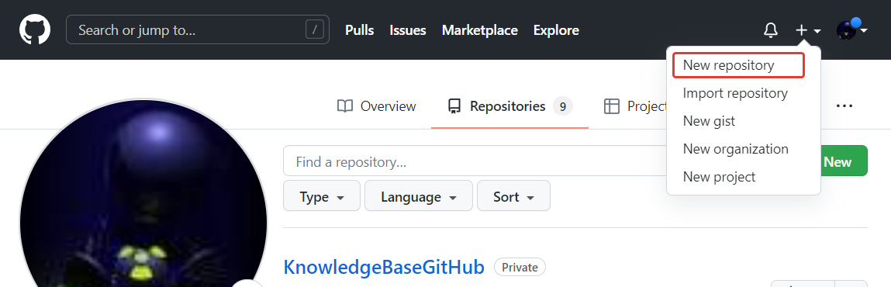
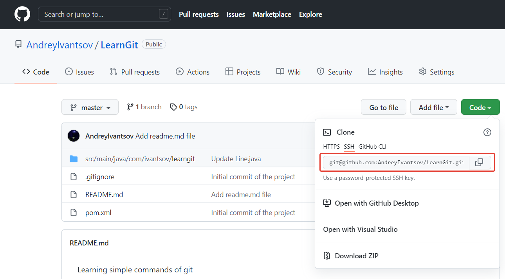

# Основные команды

### Создание удаленного репозитория

На github.com создаем новый репозиторий:



### Клонирование существующего репозитория (clone)

Перейти в папку где планируется создать папку с будущим проектом

```
$ git clone <url>
```

```
$ git clone https://github.com/AndreyIvantsov/LearnGit
```

```
$ git clone git@github.com:AndreyIvantsov/LearnGit.git
```



### Инициализация Git для проекта

В папке проекта выполняем команду (далее все команды выполняются в папке проекта)

```
$ git init
```

### Связь локального репозитория c адресом удаленного репозитория

```
$ git remote add origin https://github.com/AndreyIvantsov/LearnGit
```

```
$ git remote add origin git@github.com:AndreyIvantsov/LearnGit.git
```

Для того, чтобы посмотреть какие удаленные репозитории у нас имеются на данный момент, можно воспользоваться командами:

```
$ git remote
```

```
$ git remote -v
```

### Добавление файлов проекта в Git

Для того, чтобы изменения в файлах проекта отслеживались в Git, необходимо добавить их в локальный репозиторий.

```
$ git add <file_name>
```

```
$ git add -all
```

```
$ git add .
```

### Игнорирование файлов

Создаем файл: **.gitignore** Содержимое файла может быть примерно таким (для Java –проекта):

```
.idea/*
*.class
*.war
*.jar
*.ear
```

Далее добавляем данный файл в локальный репозиторий:

```
$ git add .gitignore
```

### Посмотреть статус проекта

```
$ git status
```

### Внесение изменений в Git (commit)

После того, как все необходимые файлы добавлены в локальный репозиторий для отслеживания Git мы можем зафиксировать все изменения, сделанные в проекте.

```
$ git commit -m “Initial commit of the project”
```

Убедимся, что вес изменения внесены

```
$ git status
```

### Отправка изменений в удаленный репозиторий (push)

```
$ git push <имя репозитория> <ветка>
```

```
$ git push origin main
```

Перед внесением изменения Git запросит имя пользователя и пароль, если не настроен ssh-key.

### Получение изменений из удаленного репозитория (pull)

```
$ git pull <имя репозитория> <ветка>
```

```
$ git pull origin master
```

### Посмотреть историю изменений

```
$ git log
```

Расширенная информация

```
$ git log -p
```

### Добавление версии проекта

```
$ git tag “ver_1.0”
```
